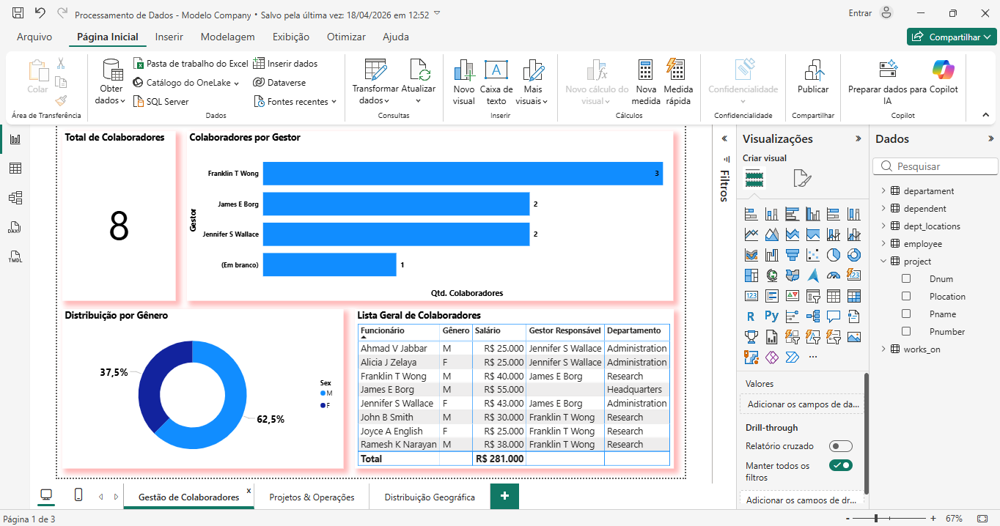
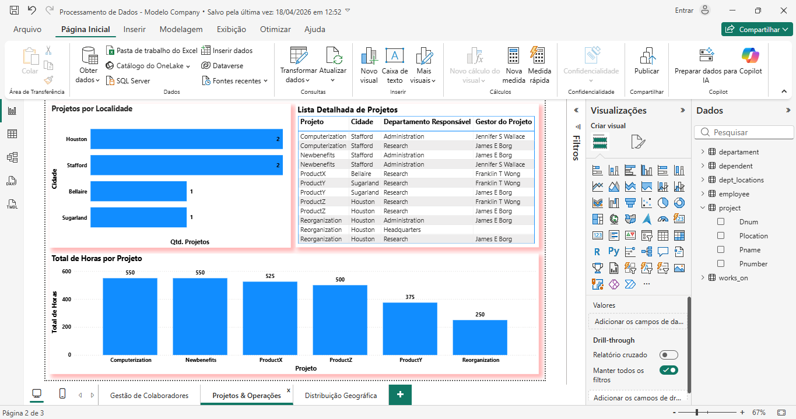
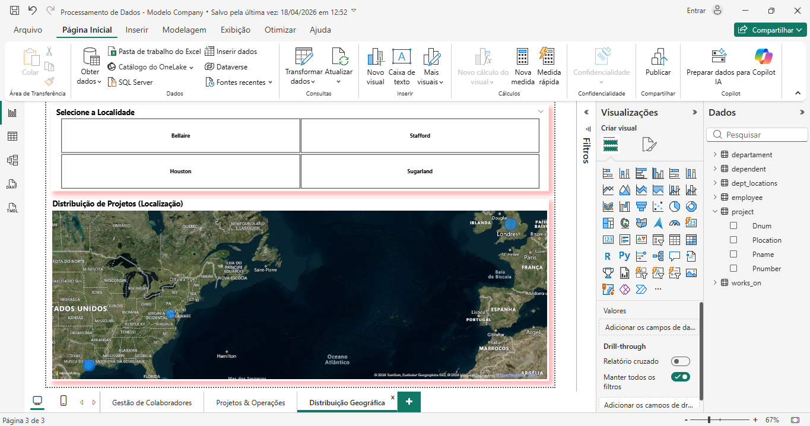
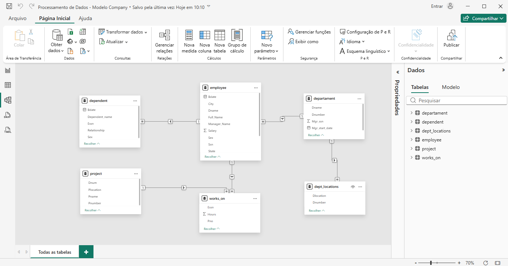
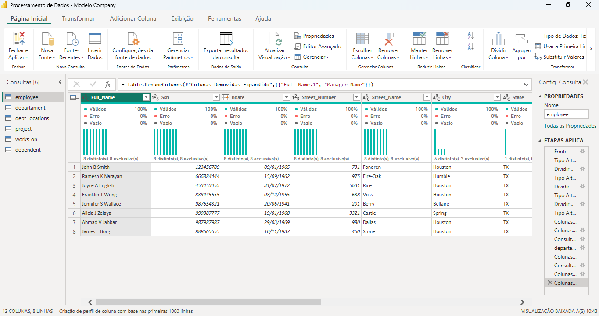
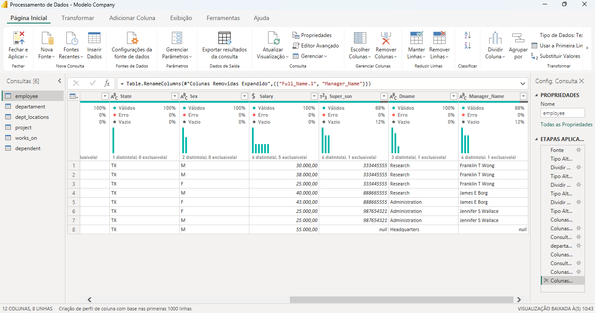
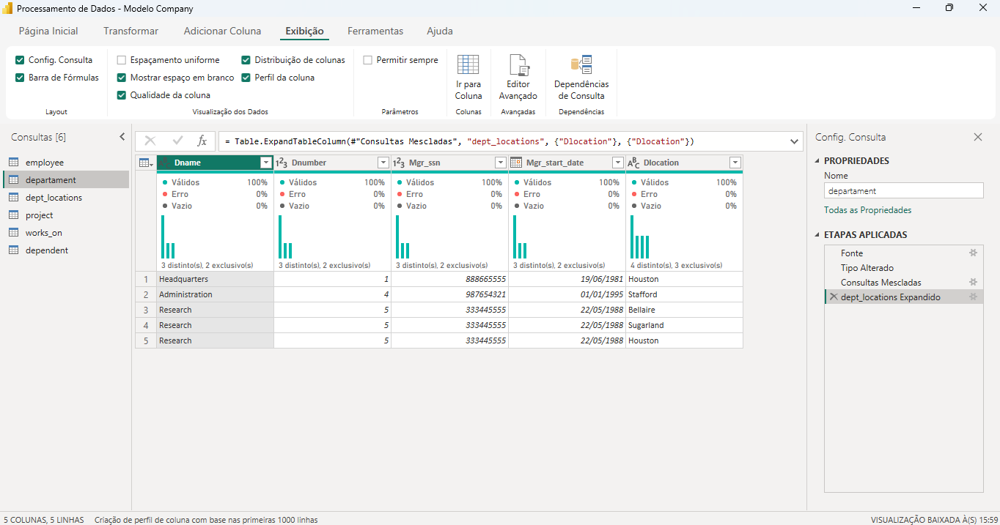
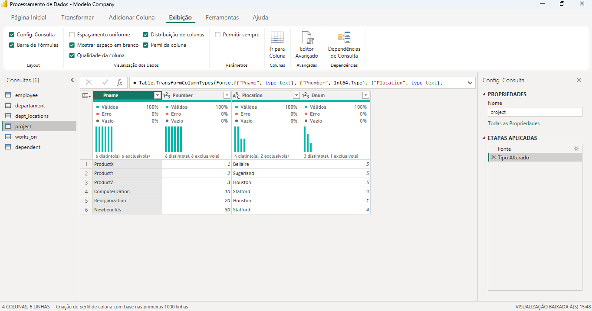

# 📊 Desafio de Projeto: Processamento de Dados e Dashboard Gerencial (MySQL + Power BI)

Este repositório contém o projeto de **Processamento e Visualização de Dados** baseado no cenário 'Company'. O trabalho consistiu na extração e tratamento de dados utilizando **Python no Google Colab**, seguido da construção de um dashboard interativo no **Power BI** para análise de indicadores gerenciais.
---

## 🏛️ Contexto e Parcerias

* **Plataforma de Ensino**: [DIO (Digital Innovation One)](https://www.dio.me/)
* **Empresa Patrocinadora**: [Klabin](https://www.klabin.com.br/)
* **Formação**: Power BI Analyst
* **Desenvolvedor**: [Fred Cavalheiro]

---

## 🛠️ Tecnologias Utilizadas

* **[Google Colab](https://colab.research.google.com/)**: Ambiente de nuvem utilizado para a instalação do servidor MySQL e execução de scripts Python.
* **[Python](https://www.python.org/)**: Linguagem de programação principal utilizada para automação e manipulação de dados.
* **[Pandas](https://pandas.pydata.org/)**: Biblioteca especializada para análise, limpeza e estruturação de dados (ETL).
* **[MySQL Server](https://www.mysql.com/)**: Configurado diretamente no ambiente Linux do Colab com autenticação `mysql_native_password` para persistência e manipulação dos dados.
* **[MySQL Connector Python](https://dev.mysql.com/doc/connector-python/en/)**: Driver utilizado para a comunicação entre o script Python e o banco de dados.
* **[Microsoft Power BI Desktop](https://powerbi.microsoft.com/)**: Criação do modelo relacional, tratamento avançado no Power Query e desenvolvimento dos visuais.

---

## ⚠️ Justificativa Técnica e Adaptações de Ambiente

Como parte do meu processo de transição de carreira, este projeto exigiu resiliência e adaptações técnicas devido a limitações de infraestrutura:

* **Substituição da Azure**: Por não possuir conta corporativa e visando evitar custos de licenciamento/cartão de crédito na nuvem Azure, optei por uma arquitetura **100% Cloud e Gratuita** utilizando Google Colab e scripts Python para simular a integração com o banco de dados.
* **Hardware e Resiliência**: O desenvolvimento foi realizado em máquina emprestada com limitações de hardware, o que impossibilitou o uso de ferramentas locais pesadas (como o MySQL Workbench). Toda a manipulação de dados foi feita via código no Colab, garantindo a integridade do processamento mesmo com restrições físicas.
* **Restrição de Publicação**: Devido à falta de e-mail institucional para o Power BI Service, a entrega é composta pelas evidências visuais (capturas de tela) e pelos arquivos fonte (`.pbix` e `.ipynb`).

---

## 🚀 Estrutura do Projeto

O projeto foi dividido em duas camadas principais:

### 1. Processamento e ETL (Backend)
* **Conexão**: Script Python para interligação dos dados no ambiente MySQL.
* **Transformação**: Limpeza de dados, tratamento de nulos e tipos de dados via Power Query no Power BI, garantindo que o modelo estivesse pronto para análise.

### 2. Dashboard Gerencial (Frontend)
O relatório foi organizado em 3 visuais estratégicos:
* **Gestão de Colaboradores**: KPIs de equipe, departamentos e análise de cargos.
* **Projetos & Operações**: Acompanhamento de horas trabalhadas e status de projetos.
* **Distribuição Geográfica**: Mapa interativo com a localização dos departamentos.

---

## 📂 Galeria de Evidências (Screenshots)

Abaixo, as capturas de tela que comprovam a execução e a qualidade técnica do projeto:

### 🖼️ Dashboards Finais
| Página 1: Gestão | Página 2: Operações | Página 3: Geográfica |
|:---:|:---:|:---:|
|  |  |  |

### ⚙️ Modelagem e Processamento (ETL)
* **Modelagem de Dados (Relacionamentos):**

* **Processamento de Tabelas (Power Query):**
| Tabela Employee | Tabela Departament | Tabela Project |
|:---:|:---:|:---:|
|  |  |  |  |

---

## 📞 Contato e Conexão
**Fred Cavalheiro**
* 🔄 **Transição de Carreira:** De Segurança Patrimonial (Vigilante) para Tecnologia/Dados.
* 🎓 **Técnico em Desenvolvimento de Sistemas** (Senac).
* 📚 **Estudante de:** Machine Learning e Análise de Dados (Python, Neo4j, Power BI e Excel).
* 🔗 **[Meu Perfil no LinkedIn](https://www.linkedin.com/in/fred-cavalheiro/)**

---
**Projeto desenvolvido para demonstrar competência técnica em ETL, SQL e Visualização de Dados sob restrições de ambiente.**
